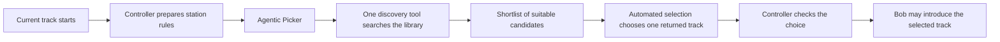
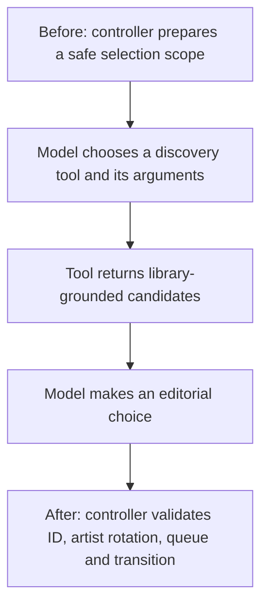
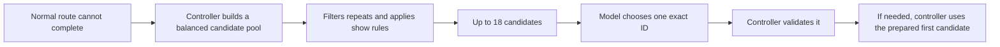

# Bob's Alternative Afternoon: how the next track is chosen

This short guide uses Bob as an example. Bob is the presenter listeners hear;
Subwave's automated music-selection system finds and chooses the next record.

The words in a Persona Soul and Show Brief matter, but they are not all the
same kind of instruction. Some are preferences, while station safeguards and
structured show settings can be rules that the selection system must follow.

## The inputs

| Input | What it does |
| --- | --- |
| Bob's Soul | Defines Bob's on-air personality. In the normal Agentic Picker it is also a **soft** music influence. It is not used by the Stateless Pool Picker. |
| Show Brief | A **soft** musical steer for both pickers: it can guide a choice but does not guarantee one. |
| Structured show tags | Genre, era, mood, energy and vocal settings. When the show is configured as strict, these become code-enforced rules where the library has enough coverage. |
| Current track and station history | Used to keep a coherent flow and avoid unnecessary repetition. |
| Blocklist, excluded playlists and queue safety | Hard rules. A model cannot select a track that controller code has excluded. |

> **Soft means “prefer this,” not “always do this.”** Bob's preference for
> overlooked album tracks may encourage a suitable search or final choice, but
> it cannot make that property true when the available library data does not
> establish it.

## The usual route: Agentic Picker

The Agentic Picker can choose from **19 discovery tools**. The tool shown in
this guide, `tracksTowardJourney`, is one example—not the picker itself.
It searches for music that follows a controller-owned musical direction and
returns up to eight eligible candidates. The automated selection step then
chooses from those returned candidates; it cannot choose a track that the tool
did not surface during that run.

### What controller code does before and after the model

This is why “the DJ chose this” is a useful listener-facing shorthand but not
the complete technical story. Bob does not manually search the library. The
system gathers candidates and applies safeguards; the model makes the final
editorial choice from what it has been shown.

## The fallback route: Stateless Pool Picker

The Stateless Pool Picker is a strong option when an all-in-one model is not
good at tool calling: controller code builds the shortlist from fixed sources,
so the model is not asked to operate discovery tools.

It still asks a model to make the **final editorial choice**. That is the
important difference: avoiding tool calls does not turn final track selection
into a purely deterministic score.

## What each route sees

| Question | Agentic Picker | Stateless Pool Picker |
| --- | --- | --- |
| Does the model choose a discovery tool? | Yes | No |
| Does it choose the final track? | Yes | Yes |
| Does Bob's Soul reach it? | Yes, as a soft influence | No |
| Does the Show Brief reach it? | Yes, as a soft influence | Yes, as a soft influence |
| Do strict show rules and safety filters apply? | Yes | Yes |
| Is it useful if model tool calling is unreliable? | Not by itself | Yes |

## A final distinction: choosing music and speaking on air

The selection process may contain candidate lists, tool results, rejected
tracks, private editorial reasoning and transition machinery. Those details
help choose music; they do not automatically help Bob speak naturally about a
single record.

When a prompt carries too much operational detail, a smaller or more
roleplay-oriented model can treat it as material to mention on air. A clean
listener-facing prompt should instead concentrate on the selected track, the
relevant show context, any safe factual detail and the available speech runway.

## Further reading

- [Track selection architecture](https://github.com/Jaz666/subwave/blob/codex/functiongemma-hybrid/docs/internals/track-selection.md)
  explains the implementation and evaluation boundary in depth.
- [Interactive overview](bob-track-selection-overview.html) is the companion
  visual draft for this guide.
